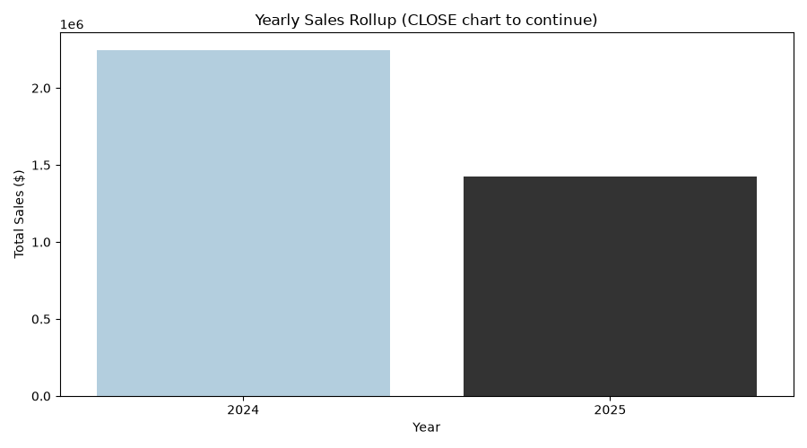
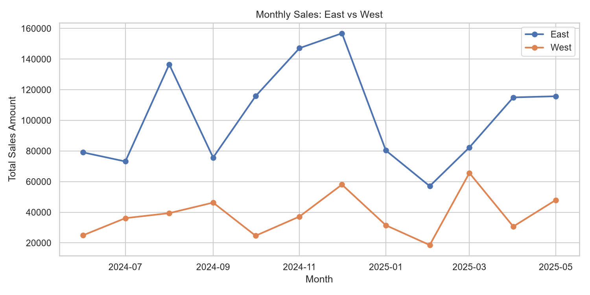
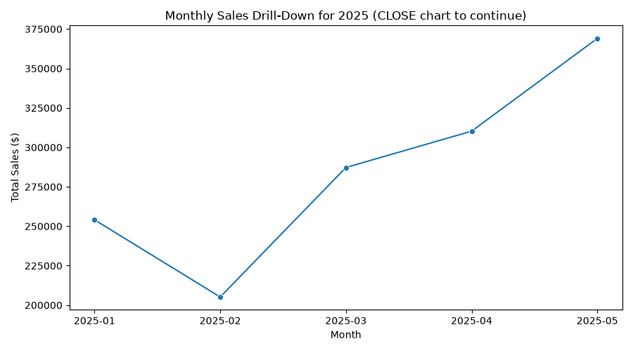
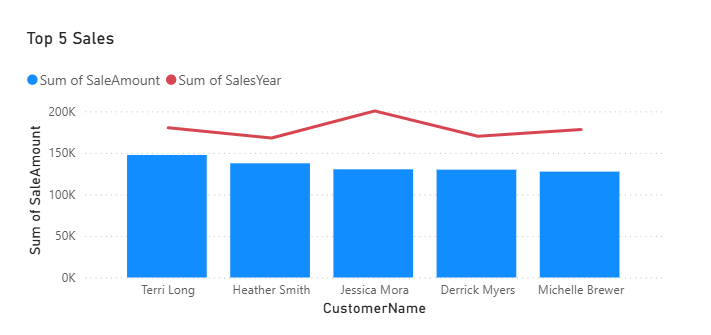
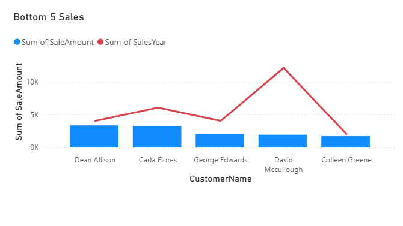
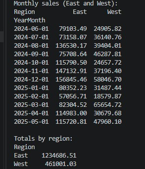
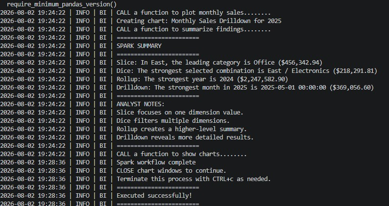

# Project Documentation

This site provides project documentation.
Use the documentation navigation to explore.

## How-To Guide

Many instructions are common to all our projects.

See
[⭐ **Workflow: Apply Example**](https://denisecase.github.io/pro-analytics-02/workflow-b-apply-example-project/)
to get the example projects running on your machine.

## Project Documentation Pages (docs/)

- **Home** - this documentation landing page
- [**Project Instructions**](./project-instructions.md)  - the standard project workflow
- [**Your Files**](./your-files.md) - how to copy the example and create your version
- [**Glossary**](./glossary.md) - project terms and concepts
- [**API**](./api.md) - autogenerated code documentation for the public project interface

## Phase 4. Technical Modification

The small technical modification I choose to make was creating a second chart that showed the West Sales.

I choose this modification, because I decided to use this project to center around the sales of the East and West for my custom project.
Having this modification helped give a bigger picture of both the sales for East region and West region.

This was verified both when the new chart generated, and I saw Expected Successfully on the project.log.

This change was somewhere in between easy and moderate.
Place it there because it did take me couple hours of reading, videos, and a failed attempt before I figured out I was making it harder then it needed to be.

## Phase 5. Custom Project

- The custom project I choose to do, was comparing the sales of the East and West Regions.
- I used PowerBI along with using Spark to generate new reports and Charts.

### Data Basics

- The data I choose to investigate was the Sales of the East and West.
- I investigated monthly and annually sales, as well as the top and bottom 5.

## Data Question

- The question I was trying to answer first, which region had the highest sales, and which had the lowest
- The reasons this question matters is because it can help forecast future budget spending, promotions, and aid in trainings

## Slice

- I used Spark for the Slice, and for this one I choose to look at the sale for West Region.

## Dice

- For the Dice I used PowerBI to analyze the West and East regions for annual sales and sales in different categories.

## Rollup

- For the Rollup I started in PowerBI but ended up moving to Spark to look.
- I first looked at quarterly sales, then moved to Spark and generated a report and chart of 2024 and 2025 sales.

## Drilldown

- For the Drilldown in PowerBI I ran a report the SalesYear for 2025.
- Within my charts it revealed the top 5 and bottom 5 sales for 2025

### Findings

- Within my Findings I found that the East out sells the West in every category, by a large number.
- It is also shown that the West is well below the average sales as well.

- This is important, because while you can expect there to be a difference the difference is quite large.
- It would be my recommendation to investigate and to find the reasoning behind the sales difference, to create a PIP.

### Final Thoughts

- This project was one of the more fascinating, using Spark and PowerBI together gave a better insight to real-world applications
- Working in auding and compliance I can utilizing using these new skills within finding errors and implementing solutions.

### Images Proof

